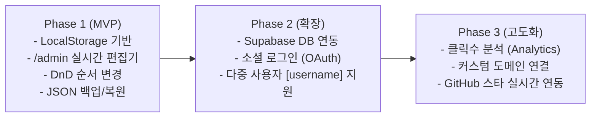

# 📋 [PRD] 마이링크 (My-Link) 제품 기능 정의서

> **버전**: v1.0 (MVP)  
> **최종 수정일**: 2026-10-03  
> **문서 상태**: 승인 완료 및 개발 준비  
> **타겟 도메인**: 개발자 및 IT 직군 특화 링크트리(Link-in-Bio) 서비스  
> **디자인 시스템**: Toss Design System (TDS)  

---

## 1. 프로젝트 개요 (Executive Summary)

### 1.1 서비스 배경 및 목적
개발자, 디자이너, PM 등 IT 직군 종사자들은 GitHub, 기술 블로그, 포트폴리오 웹사이트, 링크드인, 커피챗(Calendly) 등 다양한 채널을 운영하지만, 이를 하나로 묶어 채용 담당자나 동료에게 전달할 수 있는 **정제되고 신뢰감 있는 프로필 링크 서비스**가 부재합니다.  
**'마이링크(My-Link)'**는 토스 디자인 시스템(TDS)의 정갈하고 모던한 UI를 기반으로, 개발자 중심의 링크 관리와 실시간 미리보기를 지원하는 반응형 웹 서비스입니다.

### 1.2 핵심 가치 (Core Values)
1. **Developer-First & Professional**: 복잡한 장식 대신 가독성과 위계가 명확한 TDS 기반 미니멀 프로필 제공
2. **Real-time WYSIWYG Admin**: 좌측 입력 폼과 우측 모바일 뷰어가 실시간으로 연동되는 직관적인 편집 환경
3. **Zero-Setup MVP**: 복잡한 회원가입 없이 브라우저 로컬 저장소(LocalStorage)와 JSON 백업으로 즉시 사용 가능

---

## 2. 사용자 타겟 및 페르소나 (Target & Persona)

| 구분 | 주요 특징 | 핵심 니즈 |
|---|---|---|
| **주 타겟 (Primary)** | 이직/구직 중인 소프트웨어 엔지니어 및 테크 크리에이터 | 이력서나 SNS 프로필에 올릴 깔끔한 통합 링크 필요, 깃허브/블로그/포트폴리오 강조 |
| **보조 타겟 (Secondary)** | IT 프로덕트 디자이너, PM, 인디 해커 | 자신의 프로젝트 쇼케이스, 커피챗 예약 링크 연결 및 빠른 수정 |

---

## 3. 정보 구조도 (IA: Information Architecture) & 라우팅

```
My-Link (마이링크)
│
├── 🌐 사용자 공개 프로필 페이지 (`/` 또는 `/[username]`)
│   ├── Top App Bar (56pt, 브랜드명 + 공유 버튼)
│   ├── Profile Card (아바타, 이름, 직무, 위치, 온라인 상태, 한줄 소개, 통계 칩, 스킬 태그)
│   ├── Social Links Bar (GitHub, LinkedIn, Twitter/X, Email 등 44px 원형 버튼)
│   ├── Link List Section (TDS ListRow 기반 카드 리스트)
│   ├── Contact Banner (협업/문의 퀵 액션 카드)
│   └── Bottom CTA (56pt 하단 고정 프로필 링크 복사 버튼)
│
└── 🛠️ 관리자 대시보드 (`/admin`)
    ├── Top Navigation (프로필 미리보기 바로가기, JSON 백업/복원 버튼)
    ├── Left Panel: 관리/편집 영역
    │   ├── 1) 프로필 정보 설정 (이름, 핸들, 직무, 소개글, 아바타 URL, 상태 메시지, 통계)
    │   ├── 2) 소셜 링크 관리 (URL 입력 및 순서)
    │   ├── 3) 링크 아이템 관리 (추가, 수정, 삭제, 드래그 앤 드롭 순서 변경, On/Off 토글)
    │   └── 4) 스킬 태그 관리 (태그 추가/삭제)
    └── Right Panel: 실시간 모바일 폰 뷰어 (실시간 반응형 프리뷰)
```

---

## 4. 상세 기능 요구사항 (Functional Requirements)

### 4.1 공개 프로필 페이지 (`/`)

| 기능 ID | 기능명 | 상세 설명 | 우선순위 |
|---|---|---|---|
| **PUB-01** | 프로필 헤더 렌더링 | 고화질 아바타(72px, 22px 라운드), 이름, 인증 체크 배지, 직무, 위치, 스킬 칩 표시 | P0 (필수) |
| **PUB-02** | 통계 칩 위젯 | 출시 프로덕트, 개발 경력, 오픈소스 스타 등 3분할 수치 위젯(`tabular-nums` 적용) 렌더링 | P0 (필수) |
| **PUB-03** | 소셜 아이콘 바 | GitHub, LinkedIn, Instagram, X, YouTube, Email 등 공식 SVG 아이콘 터치 지원 | P0 (필수) |
| **PUB-04** | 링크 리스트 (ListRow) | 44px 아이콘, 타이틀, 서브텍스트, 배지(`대표 프로젝트`, `인기` 등), 우측 Chevron 클릭 시 새 탭 이동 | P0 (필수) |
| **PUB-05** | 활성화 링크 필터링 | 관리자가 '비활성화(Off)' 처리한 링크는 공개 화면에서 숨김 처리 | P0 (필수) |
| **PUB-06** | 프로필 공유 (Toast) | 상단 공유 버튼 또는 하단 Bottom-CTA 클릭 시 클립보드에 URL 복사 및 TDS 다크 토스트 출력 | P0 (필수) |
| **PUB-07** | 반응형 모바일 최적화 | 모바일 스몰(320px)부터 데스크톱까지 깨짐 없는 플렉스 레이아웃 및 56pt Bottom-CTA 보호 그라디언트 | P0 (필수) |

---

### 4.2 관리자 대시보드 (`/admin`)

| 기능 ID | 기능명 | 상세 설명 | 우선순위 |
|---|---|---|---|
| **ADM-01** | 실시간 2-분할 레이아웃 | 좌측 편집 폼에서 입력 시, 우측 모바일 폰 프레임 뷰어에 딜레이 없이 즉시 반영 | P0 (필수) |
| **ADM-02** | 프로필 기본 정보 수정 | 이름, 직무, 바이오(소개글), 위치, 아바타 이미지 URL, 상태 메시지 인라인 폼 수정 | P0 (필수) |
| **ADM-03** | 링크 추가/수정/삭제 | 링크 제목, 설명, 이동 URL, 아이콘 선택(Sparkles, Book, Code 등), 배지 설정 모달/폼 | P0 (필수) |
| **ADM-04** | 드래그 앤 드롭 순서 변경 | 링크 카드를 마우스로 드래그하거나 터치하여 노출 순서 즉시 재배치 (DnD 지원) | P0 (필수) |
| **ADM-05** | 링크 노출 On/Off 토글 | 링크를 삭제하지 않고 임시로 비활성화할 수 있는 TDS 스위치 토글 | P0 (필수) |
| **ADM-06** | 통계 수치 및 태그 편집 | 3개 통계 칩 라벨/값 수정 및 스킬 해시태그 추가/삭제 인터페이스 | P1 (중요) |
| **ADM-07** | 소셜 링크 URL 관리 | 제공되는 소셜 플랫폼 목록에 자신의 프로필 URL 입력 및 연결 | P1 (중요) |
| **ADM-08** | LocalStorage 자동 동기화 | 모든 수정 사항은 브라우저 LocalStorage(`mylink_profile_data`)에 실시간 영구 보관 | P0 (필수) |
| **ADM-09** | JSON 백업 및 복원 | 내 프로필 설정을 `.json` 파일로 다운로드(Export) 및 파일 업로드(Import) 지원 | P0 (필수) |
| **ADM-10** | 기본값 리셋 (Reset) | 언제든 초기 기본 샘플 데이터로 복구할 수 있는 리셋 액션 제공 | P1 (중요) |

---

## 5. UI/UX 및 디자인 시스템 사양 (Design Guidelines)

### 5.1 디자인 시스템 규칙 (TDS 준수)
- **Primary Color**: `Toss Blue` (`#3182F6` / `blue-500`)
  - 화면당 단 1개의 가장 중요한 기본 액션(`Bottom CTA`)에만 사용
- **Greyscale**:
  - 배경: `#F2F4F6` (`grey-100`)
  - 카드 표면: `#FFFFFF` (`white`) + 1px `#E5E8EB` (`grey-200`) 헤어라인
  - 본문 텍스트: `#191F28` (`grey-900`), 보조 텍스트: `#4E5968` (`grey-700`), 캡션: `#8B95A1` (`grey-500`)
- **Typography**:
  - 서체: `Pretendard Variable` (TPS 대체 1:1 호환)
  - 숫자: `tabular-nums` 적용 (정렬 및 통계 수치 가독성 보장)
- **Corner Radius**:
  - 카드: `20px` ~ `24px` (`radius-2xl` / `radius-3xl`)
  - 버튼: 56px 버튼 `16px` (`radius-xl`), 48px 버튼 `14px` (`radius-l`)
  - 칩 & 뱃지: `full` (999px) 또는 `6px` (`radius-xs`)
- **Copywriting Tone (Voice)**:
  - **해요체 (대화형 존댓말)** 일관 적용 ("-해요", "-있어요", "-해드릴게요")
  - 버튼 라벨은 결과 행동을 직접 명시 ("프로필 링크 복사하기", "링크 추가하기")

---

## 6. 데이터 스키마 (Data Schema)

```typescript
export interface SocialLink {
  platform: 'github' | 'instagram' | 'linkedin' | 'twitter' | 'youtube' | 'mail' | 'globe';
  url: string;
  label: string;
}

export interface LinkCardItem {
  id: string;
  title: string;
  description: string;
  url: string;
  icon: string;
  badge?: string;
  highlight?: boolean;
  image?: string;
  isActive: boolean; // 링크 노출 활성/비활성 상태
}

export interface StatItem {
  label: string;
  value: string;
  unit?: string;
}

export interface ProfileData {
  name: string;
  handle: string;
  role: string;
  bio: string;
  avatarUrl: string;
  statusText: string;
  isAvailable: boolean;
  location: string;
  stats: StatItem[];
  tags: string[];
  socials: SocialLink[];
  links: LinkCardItem[];
}
```

---

## 7. 단계별 개발 로드맵 (Roadmap)



---

## 8. 비기능적 요구사항 (Non-Functional Requirements)

1. **반응형 웹 지원 (Responsive)**:
   - 최소 320px(모바일 스몰)부터 와이드 데스크톱까지 가로 스크롤이나 레이아웃 깨짐 현상 0건
2. **성능 및 접근성 (Performance & Accessibility)**:
   - Next.js App Router 기반 빠른 초기 렌더링 및 모바일 터치 타겟 최소 44×44px 보장
3. **데이터 무손실 (Data Reliability)**:
   - LocalStorage 자동 저장 시 유효성 검사 및 손상 방지 Fallback 메커니즘 구비
