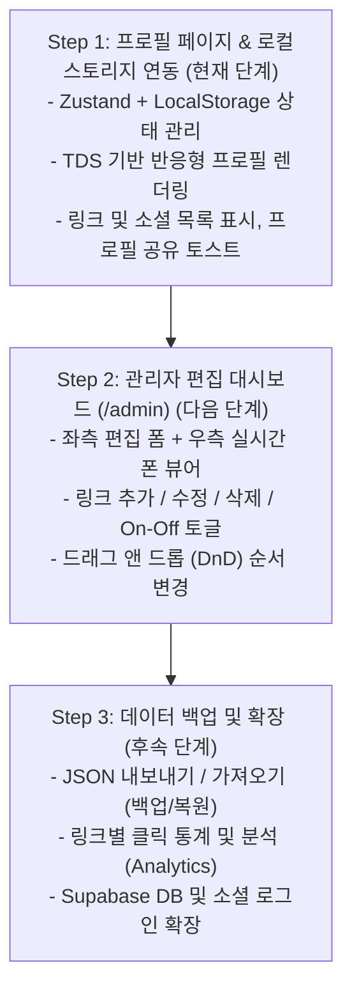

# 📋 [PRD] 마이링크 (My-Link) 제품 기능 정의서

> **버전**: v1.2 (사용자 시나리오 추가)  
> **최종 수정일**: 2026-10-03  
> **문서 상태**: 사용자 시나리오 및 시연 단계 정의 완료  
> **타겟 도메인**: 개발자 및 IT 직군 특화 링크트리(Link-in-Bio) 서비스  
> **디자인 시스템**: Toss Design System (TDS)  
> **전역 상태 관리**: Zustand (`persist` 미들웨어 기반 LocalStorage 자동 동기화)  

---

## 1. 프로젝트 개요 (Executive Summary)

### 1.1 서비스 배경 및 목적
개발자, 디자이너, PM 등 IT 직군 종사자들은 GitHub, 기술 블로그, 포트폴리오 웹사이트, 링크드인, 커피챗(Calendly) 등 다양한 채널을 운영하지만, 이를 하나로 묶어 채용 담당자나 동료에게 전달할 수 있는 **정제되고 신뢰감 있는 프로필 링크 서비스**가 부재합니다.  
**'마이링크(My-Link)'**는 토스 디자인 시스템(TDS)의 정갈하고 모던한 UI를 기반으로, 개발자 중심의 링크 관리와 반응형 모바일 뷰를 지원하는 웹 서비스입니다.

### 1.2 핵심 가치 (Core Values)
1. **Developer-First & Professional**: 복잡한 장식 대신 가독성과 위계가 명확한 TDS 기반 미니멀 프로필 제공
2. **Zero-Setup LocalStorage MVP**: 복잡한 회원가입 없이 브라우저 로컬 저장소(LocalStorage)와 Zustand를 활용하여 즉시 상태 관리 및 렌더링
3. **Step-by-Step Demonstration**: 시연 흐름에 맞추어 **1단계(프로필 페이지 & 로컬 스토리지 연동)** → **2단계(관리자 편집기)** 순으로 체계적 구현

---

## 2. 사용자 시나리오 (User Scenarios)

### 📖 시나리오 1: 방문자(채용 담당자 / 동료 개발자)의 프로필 조회 및 링크 탐색
> **페르소나**: 이력서나 SNS 링크를 타고 들어온 테크 기업 채용 담당자 '박수진' 님

1. **접속 및 첫인상 확인**:
   - `mylink` 프로필 링크에 접속하자마자, TDS 기반의 정갈한 화이트 카드와 72px 고화질 아바타, 그리고 `[온라인: 새로운 협업 및 커피챗 열려있어요 ☕]` 실시간 펄스 뱃지를 확인합니다.
2. **역량 및 통계 파악**:
   - 프로필 하단의 3분할 통계 칩(`출시 프로덕트 14개`, `개발 경력 4년차`, `오픈소스 스타 1,240개`)을 통해 지원자의 기술적 성과와 경력을 직관적으로 인지합니다.
3. **주요 링크 탐색 (ListRow)**:
   - 썸네일이 포함된 `2026 포트폴리오 웹사이트` 및 `오픈소스 & 깃허브 저장소` 카드를 클릭하여 새 탭에서 실제 코드와 프로젝트 결과물을 살펴봅니다.
4. **프로필 링크 공유**:
   - 동료 엔지니어에게 공유하기 위해 하단 56pt `[프로필 링크 복사하기]` 버튼을 누릅니다. 화면 하단에 다크 TDS 토스트 메시지(`프로필 링크가 복사되었어요`)가 뜨며 클립보드에 URL이 저장됩니다.
5. **커피챗 / 협업 문의**:
   - 프로필 하단 배너의 `[메일 보내기]`를 클릭하여 채용 면담 제안 메일을 즉시 발송합니다.

---

### 📖 시나리오 2: 링크 관리자(개발자 본인)의 프로필 실시간 수정 및 순서 배치 (Step 2 연계)
> **페르소나**: 최근 새로운 사이드 프로젝트를 배포한 프론트엔드 개발자 '이지훈' 님

1. **대시보드 접속**:
   - 자신의 링크트리를 업데이트하기 위해 `/admin` 관리자 대시보드에 접속합니다.
2. **2-분할 실시간 편집기 확인**:
   - 좌측에는 입력 폼(프로필 정보, 링크 목록, 소셜 링크), 우측에는 실제 모바일 스마트폰 프레임 뷰어가 나란히 배치되어 있음을 확인합니다.
3. **새 프로젝트 링크 추가**:
   - `[+ 새 링크 추가]` 버튼을 누르고, 프로젝트 이름, 설명, 배포 URL, 깃허브 아이콘, `대표 프로젝트` 배지를 설정합니다.
4. **드래그 앤 드롭(DnD) 순서 변경**:
   - 추가한 최신 프로젝트 카드를 마우스로 드래그하여 목록 최상단으로 옮깁니다. 우측 모바일 뷰어에서 딜레이 없이 실시간으로 첫 번째 위치에 렌더링되는 모습을 확인합니다.
5. **임시 링크 비활성화 (On/Off 토글)**:
   - 지난 분기 종료된 이벤트 링크의 스위치를 `Off`로 토글하여, 삭제하지 않고 공개 화면에서만 깔끔하게 숨깁니다.
6. **자동 저장 확인**:
   - 모든 수정 내역이 브라우저 `localStorage`에 즉시 자동 저장되어, 공개 페이지(`/`)로 이동했을 때 최신 내용이 바로 노출됩니다.

---

### 📖 시나리오 3: 로컬 데이터 백업 및 새 환경 복원 (Step 3 연계)
> **페르소나**: 회사 PC에서 작성한 프로필 설정을 집 개인 노트북으로 옮기려는 개발자

1. **JSON 파일 내보내기**:
   - `/admin` 페이지 상단의 `[JSON 백업 내보내기]` 버튼을 클릭하여 `mylink_backup.json` 파일을 다운로드합니다.
2. **새 기기에서 복원**:
   - 집 노트북 브라우저에서 마이링크에 접속한 뒤 `[JSON 파일 가져오기]`를 통해 다운로드했던 파일을 업로드합니다.
3. **데이터 완벽 복원**:
   - 프로필 정보, 링크 목록, 소셜 링크, 통계 칩이 손실 없이 그대로 복구되어 즉시 사용 가능해집니다.

---

## 3. 시연 중심 단계별 개발 로드맵 (Step-by-Step Implementation Roadmap)



---

## 4. 기능 요구사항 상세 정의

### 4.1 [Step 1] 사용자 공개 프로필 페이지 (`/`) — *현재 구현 범위*

| 기능 ID | 기능명 | 상세 설명 | 구현 방식 |
|---|---|---|---|
| **PRF-01** | 전역 상태 동기화 | Zustand `useProfileStore`의 `persist` 미들웨어를 통해 LocalStorage(`mylink_profile_data`)와 양방향 동기화 | Zustand + LocalStorage |
| **PRF-02** | 프로필 헤더 | 고화질 아바타(72px, 22px 라운드), 이름, 인증 체크 배지, 직무, 위치, 온라인 상태 칩, 한줄 소개 | React Component |
| **PRF-03** | 통계 칩 위젯 | 출시 프로덕트, 개발 경력, 오픈소스 스타 3분할 칩 (`tabular-nums` 적용) | React Component |
| **PRF-04** | 소셜 아이콘 바 | GitHub, LinkedIn, Instagram, X, YouTube, Email 원형 터치 버튼 | SVG Vector |
| **PRF-05** | 링크 리스트 (ListRow) | 44px 라운드 아이콘, 타이틀, 서브텍스트, 배지(`대표 프로젝트` 등), 우측 Chevron 클릭 시 새 탭 이동 | TDS ListRow |
| **PRF-06** | 프로필 공유 (Toast) | 상단 공유 버튼 또는 하단 56pt Bottom-CTA 클릭 시 클립보드 복사 및 TDS 다크 토스트 출력 | Clipboard API + Toast |
| **PRF-07** | 반응형 모바일 최적화 | 모바일 스몰(320px)부터 데스크톱까지 깨짐 없는 플렉스 레이아웃 및 56pt Bottom-CTA 보호 그라디언트 | Tailwind CSS |

---

### 4.2 [Step 2] 관리자 대시보드 (`/admin`) — *다음 단계 예정*

> ⚠️ **시연 단계 안내**: Step 1 프로필 페이지 시연 완료 후 순차적으로 구현 진행

| 기능 ID | 기능명 | 상세 설명 |
|---|---|---|
| **ADM-01** | 실시간 2-분할 레이아웃 | 좌측 편집 폼에서 입력 시, 우측 모바일 폰 프레임 뷰어에 딜레이 없이 즉시 반영 |
| **ADM-02** | 프로필 기본 정보 수정 | 이름, 직무, 바이오(소개글), 위치, 아바타 이미지 URL, 상태 메시지 인라인 폼 수정 |
| **ADM-03** | 링크 추가/수정/삭제 | 링크 제목, 설명, 이동 URL, 아이콘 선택, 배지 설정 모달/폼 |
| **ADM-04** | 드래그 앤 드롭 순서 변경 | 링크 카드를 마우스로 드래그하거나 터치하여 노출 순서 즉시 재배치 (DnD) |
| **ADM-05** | 링크 노출 On/Off 토글 | 링크를 삭제하지 않고 임시로 비활성화할 수 있는 TDS 스위치 토글 |

---

### 4.3 [Step 3] 데이터 백업 & 분석 (`Analytics & Backup`) — *후속 단계 예정*

| 기능 ID | 기능명 | 상세 설명 |
|---|---|---|
| **EXT-01** | JSON 백업 및 복원 | 내 프로필 설정을 `.json` 파일로 다운로드(Export) 및 파일 업로드(Import) 지원 |
| **EXT-02** | 링크 클릭 카운터 | 각 링크 클릭 시 LocalStorage 기반 클릭 수 누적 카운팅 및 대시보드 통계 표시 |
| **EXT-03** | 기본값 리셋 | 언제든 초기 기본 샘플 데이터로 복구할 수 있는 리셋 액션 제공 |

---

## 5. UI/UX 및 디자인 시스템 사양 (Toss Design System)

- **Primary Color**: `Toss Blue` (`#3182F6` / `blue-500`)
  - 화면당 단 1개의 가장 중요한 기본 액션(`Bottom CTA`)에만 사용
- **Greyscale**:
  - 배경: `#F2F4F6` (`grey-100`)
  - 카드 표면: `#FFFFFF` (`white`) + 1px `#E5E8EB` (`grey-200`) 헤어라인
  - 본문 텍스트: `#191F28` (`grey-900`), 보조 텍스트: `#4E5968` (`grey-700`), 캡션: `#8B95A1` (`grey-500`)
- **Typography**:
  - 서체: `Pretendard Variable` (TPS 대체 1:1 호환)
  - 숫자: `tabular-nums` 적용 (정렬 및 통계 수치 가독성 보장)
- **Corner Radius**:
  - 카드: `20px` ~ `24px` (`radius-2xl` / `radius-3xl`)
  - 버튼: 56px 버튼 `16px` (`radius-xl`), 48px 버튼 `14px` (`radius-l`)
  - 칩 & 뱃지: `full` (999px) 또는 `6px` (`radius-xs`)
- **Copywriting Tone (Voice)**:
  - **해요체 (대화형 존댓말)** 일관 적용 ("-해요", "-있어요", "-해드릴게요")
  - 버튼 라벨은 결과 행동을 직접 명시 ("프로필 링크 복사하기")

---

## 6. 데이터 스키마 (Data Schema)

```typescript
export interface SocialLink {
  platform: 'github' | 'instagram' | 'linkedin' | 'twitter' | 'youtube' | 'mail';
  url: string;
  label: string;
}

export interface LinkCardItem {
  id: string;
  title: string;
  description: string;
  url: string;
  icon: string;
  badge?: string;
  highlight?: boolean;
  image?: string;
}

export interface StatItem {
  label: string;
  value: string;
  unit?: string;
}

export interface ProfileData {
  name: string;
  handle: string;
  role: string;
  bio: string;
  avatarUrl: string;
  statusText: string;
  isAvailable: boolean;
  location: string;
  stats: StatItem[];
  tags: string[];
  socials: SocialLink[];
  links: LinkCardItem[];
}
```
